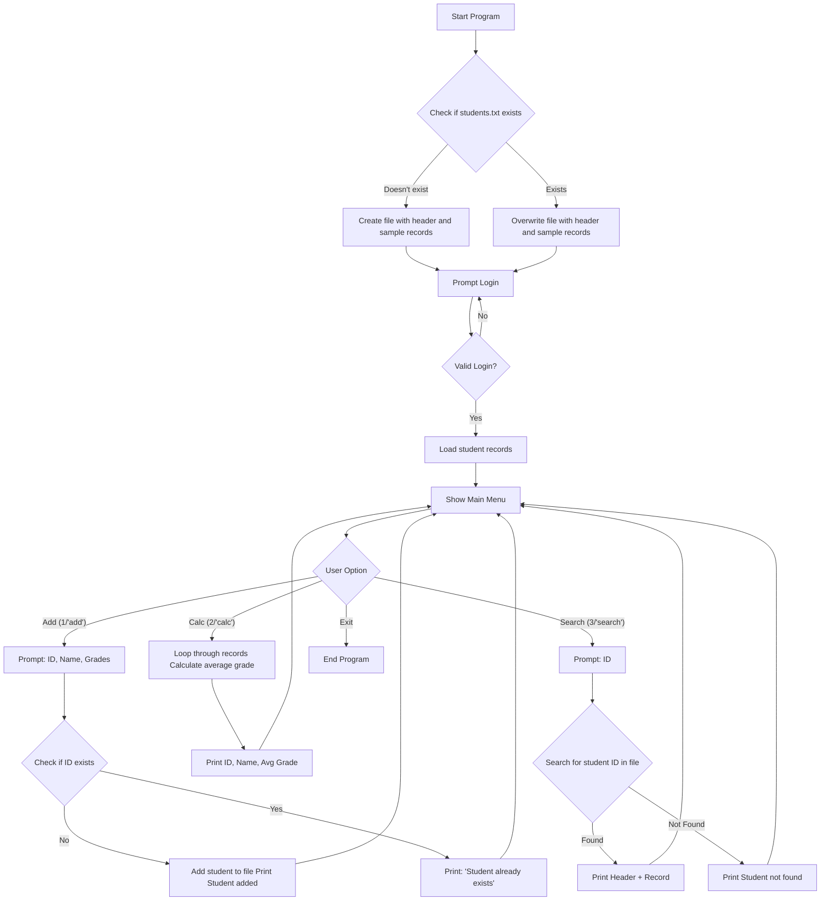

```mermaid
flowchart TD
    A[Start Program] --> B{Check if students.txt exists}
    B -->|Doesn't exist| C[Create file with header and sample records]
    B -->|Exists| D[Overwrite file with header and sample records]
    C --> E[Prompt Login]
    D --> E
    E --> F{Valid Login?}
    F -- No --> E
    F -- Yes --> G[Load student records]
    G --> H[Show Main Menu]

    H --> I{User Option}
    I -->|"Add (1/'add')" | J[Prompt: ID, Name, Grades]
    J --> K{Check if ID exists}
    K -- No --> L[Add student to file Print Student added]
    K -- Yes --> M["Print: 'Student already exists'"]
    L --> H
    M --> H

    I -->|"Calc (2/'calc')"| N[Loop through records Calculate average grade]
    N --> O[Print ID, Name, Avg Grade]
    O --> H

    I -->|"Search (3/'search')" | P[Prompt: ID]
    P --> Q{Search for student ID in file}
    Q -- Found --> R[Print Header + Record]
    Q -- Not Found --> S[Print Student not found]
    R --> H
    S --> H

    I -->|Exit| T[End Program]
```
